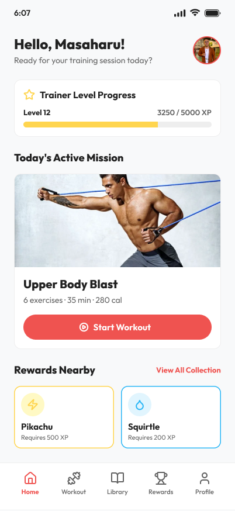
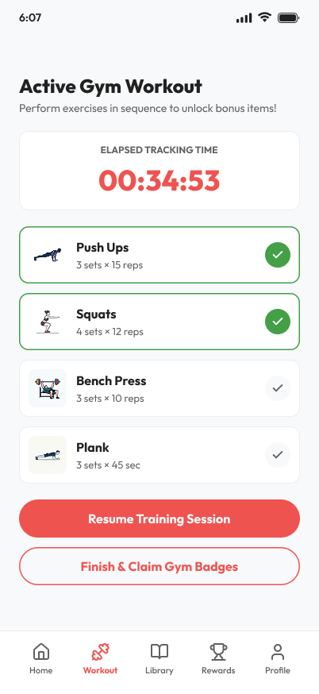
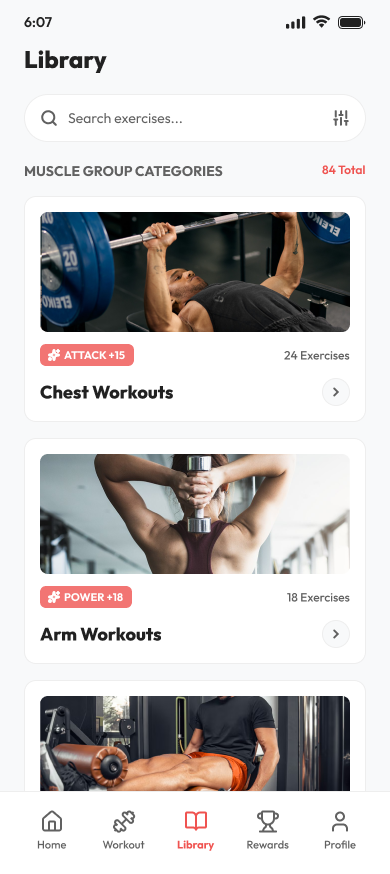
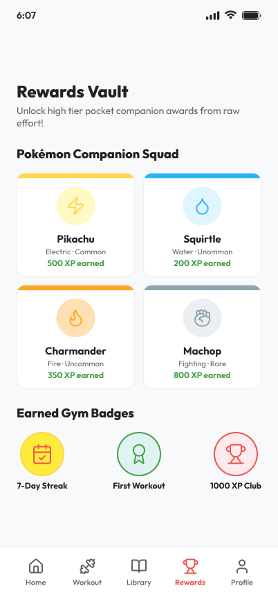
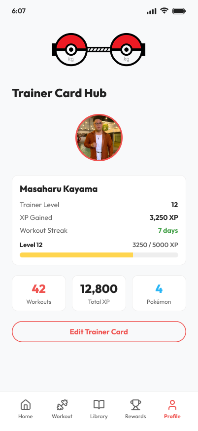
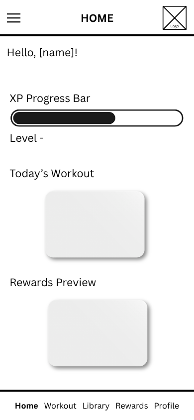
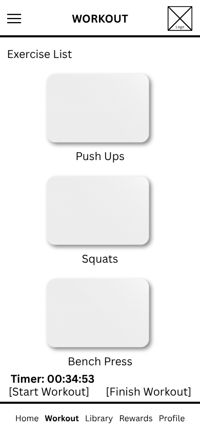
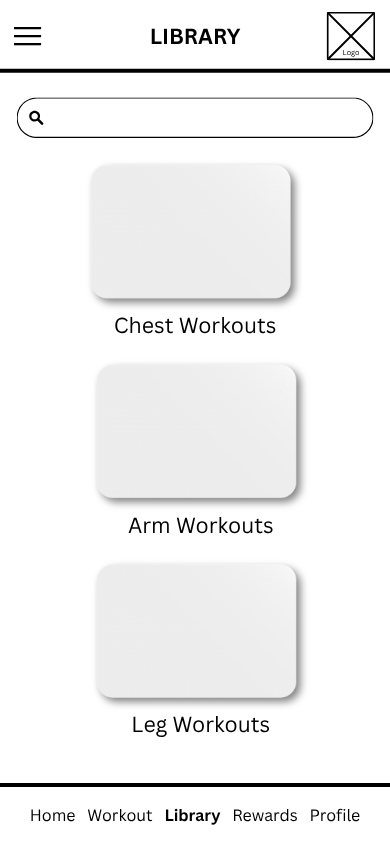
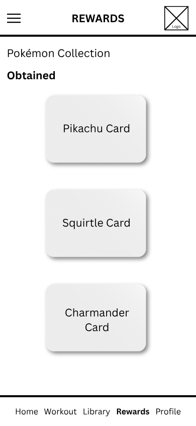
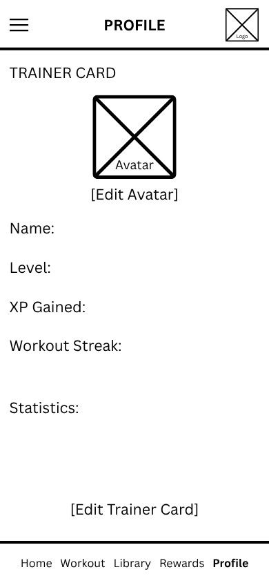

# Mockup and wireframes

The PokéStrength Gym mockup defines a clean, mobile-first fitness application with Pokémon-inspired rewards. It uses a red and yellow accent palette, rounded cards, trainer progress indicators, Pokémon reward cards, and consistent bottom navigation.

The interface supports both Light Mode and Dark Mode. Its main navigation connects five screens: Home, Workout, Library, Rewards, and Profile.

## Mockup

### Home Dashboard

The Home Dashboard gives the user a quick overview of their trainer progress, today's active mission, and available Pokémon rewards.

The screen includes an XP progress card, a workout mission card, and a Rewards Nearby section. The Start Workout action opens the Workout Tracker, while View All Collection opens the Rewards Vault.

### Active Gym Workout

The Workout Tracker displays the active workout, elapsed tracking time, individual exercise cards, and completion indicators. Exercises can be added through the Exercise Library.

The user can resume the training session and finish the workout after completing the required sets. Finishing a workout triggers the reward flow.

### Exercise Library

The Exercise Library organizes workouts into muscle groups, including Chest, Arms, and Legs. Each category card provides a visual way to browse the available exercises.

Opening a category displays its exercise list. The user can add exercises to the active workout without manually entering every exercise.

### Rewards Vault

The Rewards Vault separates the Pokémon Companion Squad from the Earned Gym Badges section.

Each Pokémon card displays its name, type, rarity, and XP earned. The rarity system assigns fixed XP values:

- Common — 100 XP
- Uncommon — 200 XP
- Rare — 500 XP
- Legendary — 1000 XP

The starter collection includes Pikachu, Squirtle, Charmander, and Machop.

### Trainer Card Hub

The Trainer Card Hub presents the trainer's profile and fitness progress in one place. It includes the trainer avatar, level, XP progress, workout streak, and available statistics.

The Edit Trainer Card action opens the profile editing screen.

## Design reference

The final visual reference is the PokéStrength Gym design system, which defines the application's colors, typography, spacing, reusable components, and Light/Dark Mode appearance.

[Figma — PokéStrength Gym](https://www.figma.com/design/Pozk8IFR6qIrJlWLJkvsS5/Pok%C3%A9Strength-Gym-App?node-id=0-1&t=oJY3JBk0i85OpSBD-1)

## Wireframes

The wireframes establish the layout and navigation of the five main screens before the detailed visual styling is applied.

## Screens

### Splash Screen

The Splash Screen introduces the application and loads the saved application data before showing the main interface.

- Loads trainer information and application data.
- Displays a loading indicator while initialization is in progress.
- Continues to the main application after initialization.

### Home Dashboard

The Home Dashboard is the main entry point to the application.

- **Trainer Level Progress:** Displays the current trainer level and XP progress.
- **Today's Active Mission:** Presents the featured workout and the Start Workout action.
- **Rewards Nearby:** Displays a small selection of collected Pokémon rewards.
- **View All Collection:** Opens the Rewards Vault.
- **Trainer avatar:** Opens the Trainer Card Hub.
- **Bottom navigation:** Opens Home, Workout, Library, Rewards, or Profile.

### Active Gym Workout

Allows the user to manage and complete the current training session.

- View selected exercises and their required sets and repetitions.
- Track exercise completion.
- View elapsed workout time.
- Add exercises from the Exercise Library.
- Resume the current training session.
- Finish the workout when the required sets are completed.

Completing a workout unlocks the next available Pokémon reward, when one remains in the catalog, and awards its XP to the trainer.

### Exercise Library

Allows the user to browse exercises by muscle group.

- Browse Chest, Arms, and Legs categories.
- Open a category to view its exercises.
- Review exercise information.
- Add an exercise to the active workout.
- Prevent the same exercise from being added more than once.

### Rewards Vault

Allows the user to view collected Pokémon and earned gym badges.

- Display the Pokémon Companion Squad.
- Display each Pokémon's type and rarity.
- Show the XP earned by each Pokémon.
- Display the Earned Gym Badges section separately.
- Keep Pokémon rewards synchronized with the current rarity and XP rules.

### Trainer Card Hub

Displays the trainer's profile and overall fitness progress.

- View the trainer's information.
- View current level and XP progress.
- View workout streak and statistics.
- Open the Edit Trainer Card screen.

### Edit Trainer Profile

Allows the user to edit the profile information supported by the application.

- Update trainer information.
- Save the changes to local storage.
- Return to the Trainer Card Hub to view the updated details.

## Main user flow

1. Open PokéStrength Gym and wait for the application data to load.
2. View trainer progress on the Home Dashboard.
3. Start a workout or add exercises from the Library.
4. Complete the required sets in the Workout Tracker.
5. Finish the workout and unlock the next available Pokémon reward.
6. View the updated collection in the Rewards Vault.
7. Check the updated XP, level, and workout statistics in the Trainer Card Hub.
