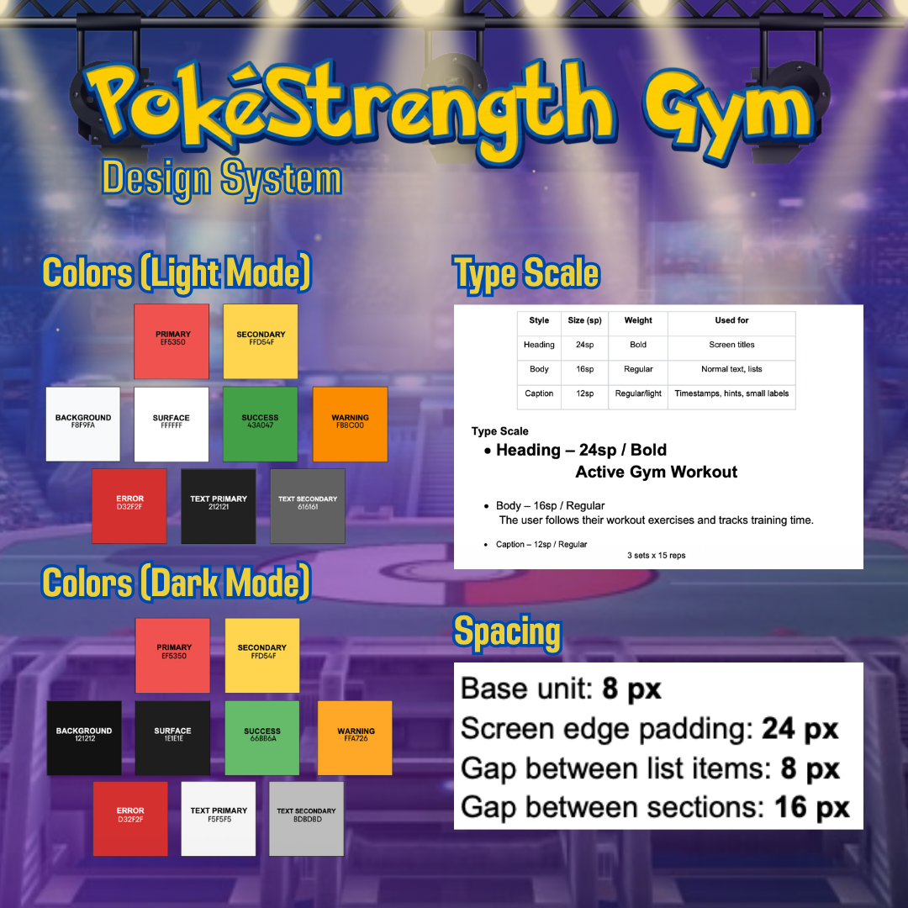

# Design system

The PokéStrength Gym design system uses a clean, mobile-first layout inspired by fitness dashboards and Pokémon progression. Red is the primary action color, yellow is the accent color, and the interface supports both Light Mode and Dark Mode.

The design prioritizes readable text, clear XP progression, recognizable exercise categories, and reusable cards and navigation components.

## Palette

### Light Mode

| Role | Color | Usage |
|---|---|---|
| Primary | `#EF5350` | Main buttons, navigation selection, and important actions |
| Secondary / Accent | `#FFD54F` | XP progress, highlights, and reward accents |
| Background | `#F8F9FA` | Main screen background |
| Surface | `#FFFFFF` | Cards, panels, and other elevated content |
| Text Primary | `#212121` | Main text and screen titles |
| Text Secondary | `#616161` | Supporting text and labels |
| Success | `#43A047` | Completed actions and XP earned |
| Warning | `#FB8C00` | Warning states |
| Error | `#D32F2F` | Error messages and error states |
| Card Border | `#E6E6E6` | Subtle borders and card separation |

### Dark Mode

| Role | Color | Usage |
|---|---|---|
| Primary | `#EF5350` | Main buttons, navigation selection, and important actions |
| Secondary / Accent | `#FFD54F` | XP progress, highlights, and reward accents |
| Background | `#121212` | Main screen background |
| Surface | `#1E1E1E` | Cards, panels, and other elevated content |
| Text Primary | `#F5F5F5` | Main text and screen titles |
| Text Secondary | `#BDBDBD` | Supporting text and labels |
| Success | `#66BB6A` | Completed actions and XP earned |
| Warning | `#FFA726` | Warning states |
| Error | `#D32F2F` | Error messages and error states |
| Card Border | `#333333` | Borders and separation between dark surfaces |

The colors are defined in `lib/theme/app_theme.dart`. The app uses a shared theme so that widgets can respond to the current brightness instead of hardcoding a single appearance.

## Pokémon type colors

Pokémon reward cards use the Pokémon's primary type to determine the accent color.

| Type | Color | Hex |
|---|---|---|
| Normal | Gray | `#9E9E9E` |
| Fire | Red | `#EF5350` |
| Water | Blue | `#42A5F5` |
| Grass | Green | `#66BB6A` |
| Electric | Yellow | `#FFD54F` |
| Ground | Brown | `#8D6E63` |
| Bug | Light Green | `#9CCC65` |
| Psychic | Pink | `#EC407A` |
| Poison | Violet | `#AB47BC` |
| Fighting | Mahogany | `#8D4A3E` |
| Flying | Light Blue | `#81D4FA` |
| Rock | Light Brown | `#BCAAA4` |
| Ice | Sky Blue | `#4FC3F7` |
| Ghost | Indigo | `#5C6BC0` |
| Dragon | Purple | `#7E57C2` |

## Rarity and XP colors

Rarity determines the XP value assigned to a Pokémon reward.

| Rarity | XP | Display purpose |
|---|---:|---|
| Common | 100 XP | Standard reward |
| Uncommon | 200 XP | Middle-evolution reward |
| Rare | 500 XP | Final-evolution or non-evolving reward |
| Legendary | 1000 XP | Designated Legendary reward |

The XP value is determined by the reward catalog, not by the visual card widget.

## Type scale

| Style | Size | Weight | Usage |
|---|---:|---|---|
| Heading | 24 px | Bold | Main section headings and screen titles |
| Body | 16 px | Regular | General content and descriptive text |
| Caption | 12 px | Regular | Supporting labels and secondary information |
| Compact Label | 10–11 px | Bold or Regular | Small reward-card details where space is limited |

Text size may be adjusted when required by a compact component, but the hierarchy should remain consistent and readable.

## Spacing

Spacing follows an 8-pixel base unit.

| Name | Value | Usage |
|---|---:|---|
| Base unit | 8 px | Foundation for spacing and sizing |
| Tight spacing | 4 px | Closely related text or icon elements |
| Gap between list items | 8 px | Exercise rows and compact cards |
| Gap between sections | 16 px | Separation between major content groups |
| Screen edge padding | 24 px | Main screen content margins |
| Card padding | 12–16 px | Internal card spacing |

The spacing system should be reused rather than replaced with unrelated values throughout the application.

## Components

| Component | File | Purpose | Screens |
|---|---|---|---|
| App Logo | `lib/widgets/app_logo.dart` | Displays the appropriate logo for Light or Dark Mode | Splash, Home, and other branded areas |
| Primary Button | `lib/widgets/primary_button.dart` | Reusable primary action button | Workout and other action screens |
| App Bottom Navigation | `lib/widgets/app_bottom_nav.dart` | Navigates between Home, Workout, Library, Rewards, and Profile | Main application |
| XP Progress Bar | `lib/widgets/xp_progress_bar.dart` | Displays the current level and XP progress | Home, Trainer Profile |
| Trainer Avatar | `lib/widgets/trainer_avatar.dart` | Displays the trainer avatar | Home, Trainer Profile |
| Reward Card | `lib/widgets/reward_card.dart` | Displays Pokémon name, type, rarity, and XP earned | Home, Rewards Vault |
| Section Header | `lib/widgets/section_header.dart` | Provides consistent section headings | Multiple screens |

### Reward Card

The `RewardCard` widget accepts:

- `pokemonName`
- `type`
- `rarity`
- `xpEarned`
- Optional `accentColor`
- Optional `image`

The card uses the Pokémon type to determine its accent color when no custom accent is provided. It displays rarity separately from the type and XP so users can distinguish those values quickly.

### XP Progress Bar

The `XpProgressBar` displays the trainer level and the current XP progress toward the next level. The XP requirement is provided by the application logic.

### App Bottom Navigation

The bottom navigation gives consistent access to the five main sections:

- Home
- Workout
- Library
- Rewards
- Profile

The selected and unselected states use theme-aware colors so the navigation remains readable in both themes.

## Changes since the last version

- **Initial palette:** Established red as the primary color and yellow as the accent for XP and rewards.
- **Dark Mode:** Added a dark background and surface colors with lighter text and borders.
- **Reusable components:** Organized shared UI elements into reusable widgets to avoid repeating the same layouts.
- **Pokémon type palette:** Added a consistent color mapping for Pokémon types so reward cards can identify their primary type visually.
- **Rarity display:** Separated rarity from Pokémon type and assigned consistent XP values to each rarity.
- **Responsive card layout:** Removed unnecessary fixed-height constraints from reward cards and adjusted spacing to reduce overflow on smaller screens.
